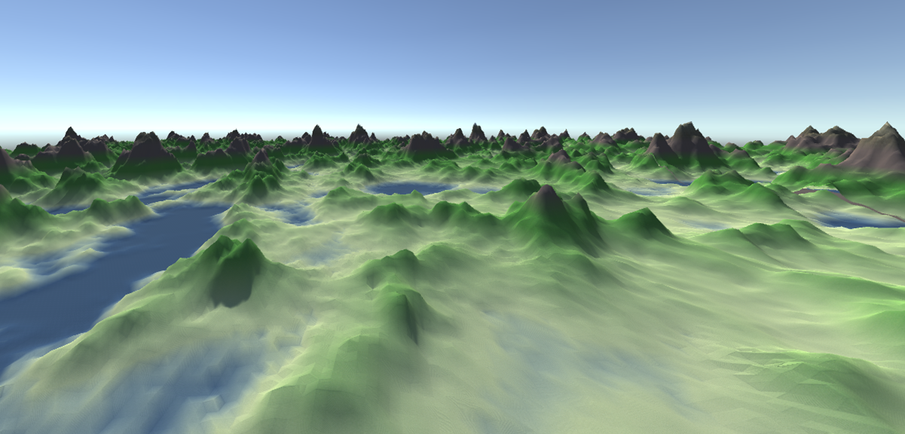

# Procedural Terrain Generation

Application that pocedurally generates infinite terrain based on given chosen noise map. Possible options are:
- *Perlin noise*
- *OpenSimplex noise*
- *Custom noise*

Custom noise implementation uses different types of interpolation to achieve natural terrain look. Possible options are:
- *Bilinear*
- *Cosine*
- *Acceleration*
- *Quadratic*
- *Qubic*

To achieve different levels of terrain detail, user can adjust number of octaves, lacunarity and persistance.

Here is an example of terrain:

When it's raining, every drop of rain takes with it some sediment while sliding down the terrain. When the droplet hits a plateu or reaches its maximum capacity, it releases the sediment. This process erodes the terrain and makes it look more natural. 
User can choose:
- Gravitation strength
- Droplet lifetime
- Droplet inertion
- Erosion speed
- Evaporation speed

Here is an example of terrain after hydraulic erosion:

